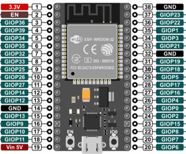
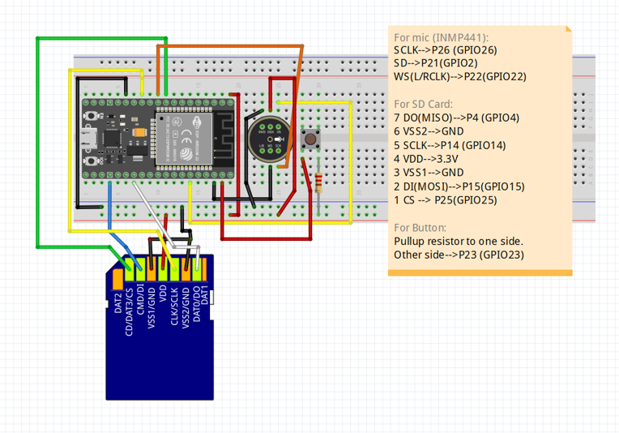

This code is for use in creating wav file recordings. It is taken from https://github.com/atomic14/esp32_sdcard_audio/.  I'm following Atomic14's great tutorials and doing some experimenting. I am using this device to build a library of audio clips for later use in training a trigger word (wake word) detector.

**How to use: ** 

- Once build you record audio clips by holding down the button.  When the button is released it saves the file as "testN.wav" where N is incremented each time you press the button (test1.wav, test2.wav, etc).
- Then you pull out the microSD card and move the files wherever you want.

<u>***BUILDING HARDWARE:***</u>

**To make this you need:** 
	1) ESP32 dev board, 
	2) SD-microSD card adaptor (soldered directly to wires),
	3) an INMP441 mic board,
	4) a momentary pushbutton, 
	5) a resistor (I used 220ohm),
	6) soldering iron and solder,
	7) some jumpers,
	8) breadboard,
	9) and a microSD card.

I used this ESP32: https://www.amazon.com/HiLetgo-ESP-WROOM-32-Development-Microcontroller-Integrated/dp/B0718T232Z/; which has this pin out:

I used this INMP I2S mic board: https://www.amazon.com/DAOKI-Omnidirectional-Microphone-Interface-Precision/dp/B0821521CV/

Here is the circuit:

<u>***COMPILING SOFTWARE:***</u>

I use VSCODE and PlatformIO for Arduino programming on the ESP32.  If you want you can use Arduino's IDE as well, but these instructions assume you have VSCODE and PlatformIO. You will also need to install the Espressif 32 platform to add its boards. The HiLetgo board is the NodeMCU-32S board in that platoform.

Follow this tutorial to set those up if not done: https://randomnerdtutorials.com/vs-code-platformio-ide-esp32-esp8266-arduino/

When you get to the part where you're setting up a project then select the NodeMCU-32S board as the target and copy all the files in this repository into the project.

Now hook up the board to your computer.

CLick the checkmark at the bottom left of VSCODE to build it.

Click the right arrow at the bottom left of VSCODE to push the binary file onto your ESP32. (You might have to hold-down the "boot" or "IO0" button to allow it to connect and send the binary file to the ESP32.)
